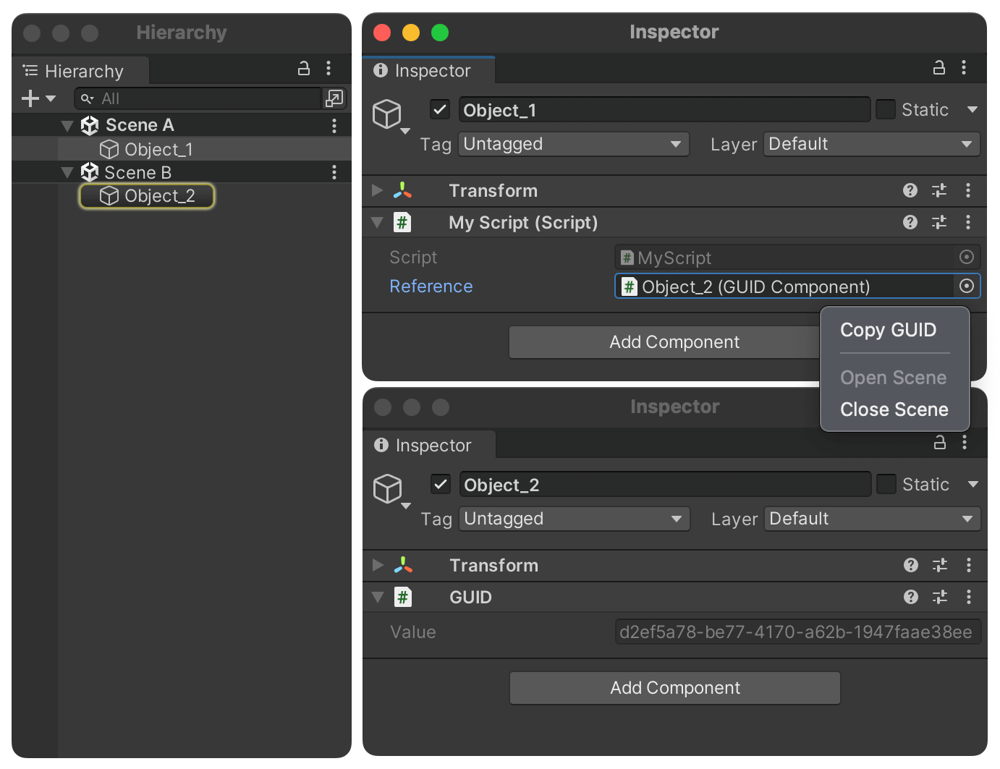

# GUID Component & Reference [](https://openupm.com/packages/com.maligan.guid/)

Unity GUID based cross-scene reference component with robust GUID generation and quality UX.

Please note, Unity-Technologies has its own implementation:

- https://github.com/Unity-Technologies/guid-based-reference

## How To
##### 1. Add `GUIDComponent` to GameObject
##### 2. Add `GUIDReference` field to your script
```cs
[SerializeField]
private GUIDReference m_Reference;
```
##### 3. Resolve at runtime
```cs
// Resolve via GUIDReference
var component = m_Reference.GetComponent<GUIDComponent>();

// Resolve via GUIDComponent
var component = GUIDComponent.Find("OBJECT-GUID-HERE");
```

## Features

- **Safe** - `GUIDComponent` ignores component *resets* and prefab *reverts*. You will never lose your generated GUIDs. The only way to erase existing GUID is manually component removing.

- **Easy** - GUIDs are generated automatically and respect object duplication.

- **Handy** - Open/Close referenced scenes from property context menu or with double-click.

- **Neat** - `GUIDReference` property drawer looks like general object field.

## Installation

```sh
# 1. Via OpenUPM
openupm add com.maligan.guid

# 2. Via PackageManger & GitHub URL
https://github.com/maligan/unity-guid.git

# 3. Via copy this repository content into Packages/ folder
```

## Gallery

